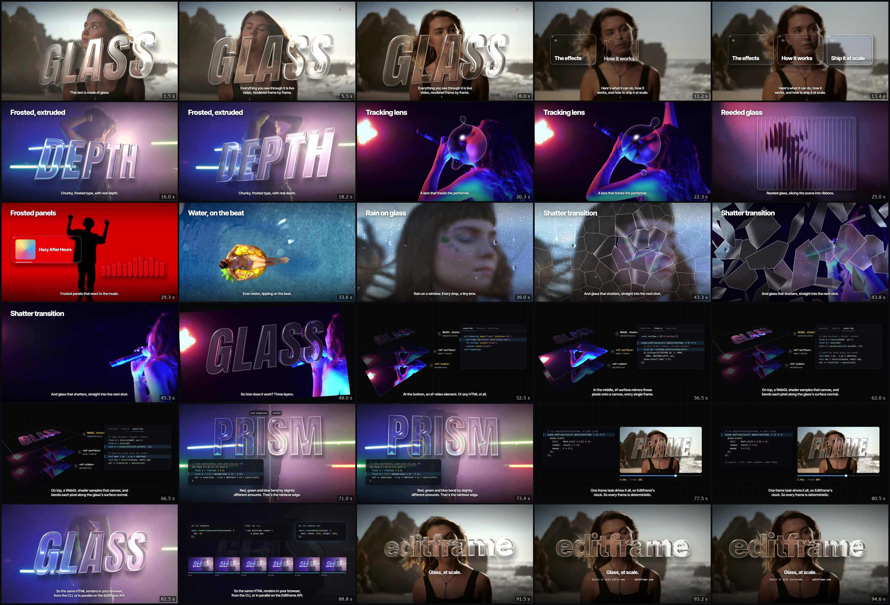

# Glass shaders over live video

Real-time glass refracting live footage: frosted extruded type, a lens that tracks a singer, reeded panes, rain, a shatter transition and prism dispersion. It's all one [Editframe](https://editframe.com) composition: HTML, `<ef-video>`, `<ef-surface>` and a WebGL2 fragment shader. The same composition previews in the browser, renders from the CLI, and renders in parallel on the Editframe API.

https://github.com/user-attachments/assets/40a2b392-8701-4244-b046-07e19f59a2fe

## What's in the video



| Effect | Shader mode | How it works |
|---|---|---|
| Frosted, extruded type | `EXTRUDE` | A ray is marched through a rounded extrusion of the text's distance field. Frost grows with the distance travelled inside the glass. |
| Tracking lens | `BLOBS` | Metaballs follow the singer's face, using a track made with Gemini (`src/tracks/singer.json`). |
| Reeded glass | `REEDED` | Vertical ribs slice the scene into ribbons. |
| Frosted panels | `PANELS` | Rounded panels whose heights follow the music's spectrum (`getFrequencyData`). |
| Water, on the beat | `WATER` | Ripples start on the 121 BPM beat grid. |
| Rain on glass | `RAIN` | A fogged window with drops that slide and refract. |
| Shatter transition | `SHATTER` | Shards of a frozen frame fall away from the next live shot. |
| Prism | `SDF` | A bevelled glass plane with nine-wavelength dispersion. |

## How it works

Every glass scene is three layers:

```html
<ef-timegroup mode="fixed" duration="4.4628s" data-scene="chunky" class="scene">
  <ef-timegroup mode="fit" class="plate">
    <ef-video id="chunky-video" src="/src/assets/neon.mp4" sourcein="4s" mute></ef-video>
    <ef-surface target="chunky-video"></ef-surface>
  </ef-timegroup>
  <canvas class="glass-canvas"></canvas>
</ef-timegroup>
```

1. `<ef-video>` decodes the footage. It could be any HTML, since `<ef-surface>` can target any element.
2. `<ef-surface>` mirrors that element's pixels into a canvas on every frame. `surface.getDisplayCanvas()` returns it.
3. A frame task uploads that canvas to WebGL and draws the glass over it into `canvas.glass-canvas`.

`src/glass/scene.js` does the wiring:

```js
timegroup.addFrameTask(async (info) => {
  const { mode, uniforms } = await frame(ctx, info);
  ctx.renderer.render(ctx.surface.getDisplayCanvas(), mode, uniforms);
});
```

Each scene in `src/scenes/index.js` returns shader uniforms as a function of time. This is the "DEPTH" shot:

```js
frame(_ctx, { ownCurrentTime: t }) {
  const k = ease.inOutSine(t / 4.46);
  return {
    mode: MODE.EXTRUDE,
    uniforms: {
      ...placeSolid({ y: 700, rotateY: lerp(30, -22, k), rotateX: lerp(14, 4, k), rotateZ: -3 }),
      ...FROSTED,
      // The slab thickens as the voiceover says "real depth".
      uDepth: track(t, [[0, 40], [1.4, 40], [2.8, 105]]),
    },
  };
}
```

The shader (`src/glass/shader.js`) answers two questions for every pixel: is it covered by glass, and which way does the glass surface face there? For extruded type it marches a ray into the solid, refracts it on the way in, walks it through the slab, and refracts it on the way out once per color channel, so the edges split into a rainbow:

```glsl
vec3 r1 = refract(rd, nO, 1.0 / uIor);           // into the glass
// ...march to the back face, measuring how far the ray travels inside...
float lod = uFrost + travelW * 0.012 * uMilk;    // longer path, more frost
for (int c = 0; c < 3; c++) {
  float ior = uIor * (1.0 + (float(c) - 1.0) * uDispersion * 0.035);
  vec3 r2 = refract(r1, -nx, ior);               // out of the glass, per channel
  vec2 s = footageHit(qW, normalize(uSolidRot * r2));
  col[c] = sceneSoft(s, lod)[c];                 // sample this frame of the video
}
```

Frost is a blurrier mip level of the footage texture, chosen by how far the ray travelled inside the glass, so thick parts of a letter look milkier than thin ones.

Every value comes from `ownCurrentTime`, so seeking to any time always produces the same frame. That's what lets one composition render frame by frame in a browser, from the CLI, or in parallel slices on the API.

## Things worth knowing if you build your own

- **Put the video and its `<ef-surface>` in their own `mode="fit"` timegroup.** The surface has then mirrored the current frame by the time your frame task runs.
- **Drive everything from `ownCurrentTime`.** Don't use `requestAnimationFrame` or the wall clock; seeking and exporting depend on it.
- **DOM changes made inside a frame task reach an `<ef-surface>` mirror one frame late.** Animate HTML that sits behind the glass with CSS animations instead. Editframe advances them in step with the timeline.
- **Share one WebGL context.** Exports clone the composition, and browsers cap live WebGL contexts at around 16. `src/glass/renderer.js` renders every scene in one offscreen context with `preserveDrawingBuffer: true`, then copies the result into each scene's 2D canvas.
- **Keep canvases at their full 1920×1080 CSS size, and shrink them with `transform: scale()`.** In CLI renders, a canvas or `<ef-surface>` that's smaller in CSS than its pixel size gets cropped rather than scaled.
- **`getFrequencyData(t)` works on a muted `<ef-audio>`.** The demo analyzes a muted copy of the music and plays a separate mix that's ducked under the voiceover.
- **Build distance fields for extruded text at 2×.** The surface normals come from the field's gradient, and a 1× field leaves stripes on the walls.

## Run it

```bash
npm install
npm run dev       # preview and scrub the timeline at http://127.0.0.1:5199
npm run render    # with the dev server running; writes output/glass-demo.mp4
```

The full 96-second render takes about 50 seconds on an Apple Silicon Mac. To render in the cloud instead, see the [Editframe docs](https://editframe.com/docs).

## Project layout

```
index.html              the timeline: 13 scenes, captions, voiceover and music
src/scenes/index.js     per-scene animation, all as functions of time
src/glass/shader.js     the fragment shader, with all eight glass modes
src/glass/renderer.js   shared WebGL2 engine and 3D placement (placePlane, placeSolid)
src/glass/sdf.js        turns text and shapes into signed distance fields
src/glass/scene.js      wires a timegroup, its ef-surface and its canvas together
src/glass/gl.js         WebGL2 plumbing
src/tracks/singer.json  face track for the lens
scripts/                voiceover, audio mix, QA and frame-grab tools
test.html               shader look-dev page
```

## Voiceover and audio

The voiceover is generated with Gemini TTS (`gemini-3.8-flash-tts`, voice Charon) from `scripts/vo-script.json`. These scripts need a `GEMINI_API_KEY` environment variable.

- `scripts/tts.mjs` generates the clips. It also strips the short click at the start and the 140 ms noise burst at the end that Gemini TTS adds to every clip.
- `scripts/vo-check.mjs` and `scripts/vo-retake.sh` have Gemini listen to each take for mispronunciations, and keep the best one.
- `scripts/mix.mjs` normalizes the voiceover to −16 LUFS and builds `src/assets/bed_mix.wav`, the music ducked under the voice.
- `scripts/track.mjs` builds the lens's face track with Gemini.
- `scripts/frames.mjs` and `scripts/lookdev.mjs` grab frames with Playwright.

## Credits

Footage, music and sound effects are from [Mixkit](https://mixkit.co), under the [Mixkit free licenses](https://mixkit.co/license/). The clips were re-encoded to 1080p and trimmed; some were also graded or slowed down.

| File | Source |
|---|---|
| `hero.mp4` | [Mixkit video 1104](https://assets.mixkit.co/videos/1104/1104-2160.mp4), graded and reframed |
| `face.mp4` | [Mixkit video 32755](https://assets.mixkit.co/videos/32755/32755-2160.mp4) |
| `neon.mp4` | [Mixkit video 33906](https://assets.mixkit.co/videos/33906/33906-2160.mp4) |
| `singer.mp4`, `singer_loop.mp4` | [Mixkit video 478](https://assets.mixkit.co/videos/478/478-2160.mp4), slowed to half speed |
| `pool.mp4` | [Mixkit video 52476](https://assets.mixkit.co/videos/52476/52476-2160.mp4) |
| `silhouette.mp4` | [Mixkit video 51757](https://assets.mixkit.co/videos/51757/51757-2160.mp4) |
| `smoke.mp4` | [Mixkit video 33899](https://assets.mixkit.co/videos/33899/33899-2160.mp4) |
| `bed.mp3` | "Hazy After Hours", [Mixkit music 132](https://assets.mixkit.co/music/132/132.mp3) |
| `sfx/shatter.wav` | Mixkit sound effect 2942 |
| `sfx/rain.wav` | Mixkit sound effect 2390 |

The fonts (Anton, Inter Tight and JetBrains Mono) are under the SIL Open Font License 1.1.
